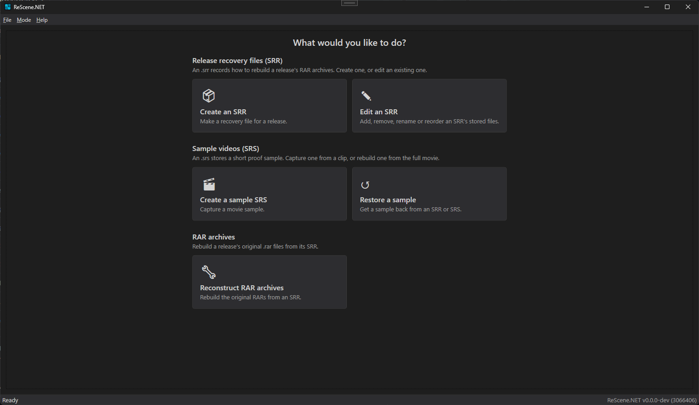
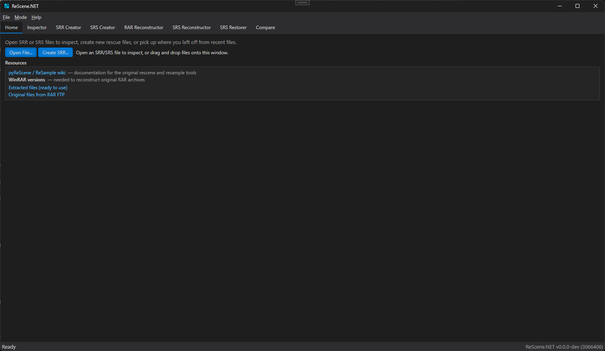

# ReScene.NET

A Windows desktop application for inspecting, creating, and reconstructing [ReScene](https://rescene.wikidot.com/) (SRR/SRS) files, built with WPF and .NET 10.

It runs in two modes, switchable any time from the **Mode** menu (or in Settings); the choice is remembered:

### Beginner

A guided home hub of task cards — each opens a focused, step-by-step wizard (Create an SRR, Create an SRS, Reconstruct RAR archives, Restore a sample, Edit an SRR).



### Advanced

The full tabbed workbench, with every tool on its own tab.



## Features

- **Inspect** the internal block structure of `.srr`, `.srs`, `.rar`, and `.mkv`/`.webm` files — tree view, property grid, and an integrated hex viewer, with block/stored-file export.
- **Create SRR** files from RAR archives (single or multi-volume) or SFV manifests, with stored-file curation and optional OSO hashes.
- **Create SRS** sample files across 7 container formats (AVI, MKV, MP4, WMV, FLAC, MP3, Stream/M2TS), including ISO/IMG input and optional track match offsets.
- **Reconstruct RAR archives** from SRR metadata via brute-force WinRAR version/parameter discovery, with header patching and rename-to-original output.
- **Rebuild and restore samples** from `.srs` (single) or an `.srr`'s embedded samples (batch), with CRC32 verification.
- **Compare** two RAR/SRR/SRS/MKV/WebM files side by side, with differences highlighted (down to byte-level cluster payloads for MKV/WebM).
- Drag & drop (or command-line) opens SRR/SRS/RAR/MKV files straight in the Inspector.

## Requirements

- [.NET 10.0](https://dotnet.microsoft.com/download/dotnet/10.0)
- Windows (WPF)

## Getting Started

```bash
# Clone with submodules
git clone --recurse-submodules https://github.com/NeWbY100/ReScene.NET.git
# (or, if already cloned) git submodule update --init --recursive

dotnet build
dotnet run --project ReScene.NET
```

## Project Structure

```
ReScene.NET/
├── ReScene.NET/            # WPF desktop application (.NET 10): Views, ViewModels, Services, …
└── ReScene.Lib/            # Git submodule — shared library (net8.0 + net10.0)
    ├── ReScene/            # RAR / SRR / SRS parsing & writing, Core reconstruction & compare
    └── ReScene.Tests/      # xUnit tests
```

`ReScene.Lib` is versioned and released independently (see its [repository](https://github.com/NeWbY100/ReScene.Lib)).

## Dependencies

| Package | Version | Project |
|---|---|---|
| [CommunityToolkit.Mvvm](https://www.nuget.org/packages/CommunityToolkit.Mvvm) | 8.4.2 | ReScene.NET |
| [Crc32.NET](https://www.nuget.org/packages/Crc32.NET) | 1.2.0 | ReScene |
| [System.IO.Hashing](https://www.nuget.org/packages/System.IO.Hashing) | 9.0.4 | ReScene |
| [CliWrap](https://www.nuget.org/packages/CliWrap) | 3.10.0 | ReScene |
| [DiscUtils.Iso9660](https://www.nuget.org/packages/DiscUtils.Iso9660) / [.Udf](https://www.nuget.org/packages/DiscUtils.Udf) | 0.16.13 | ReScene |
| [ReScene.Lib](https://github.com/NeWbY100/ReScene.Lib) | submodule | — |

## License

See [LICENSE](LICENSE) for details.
