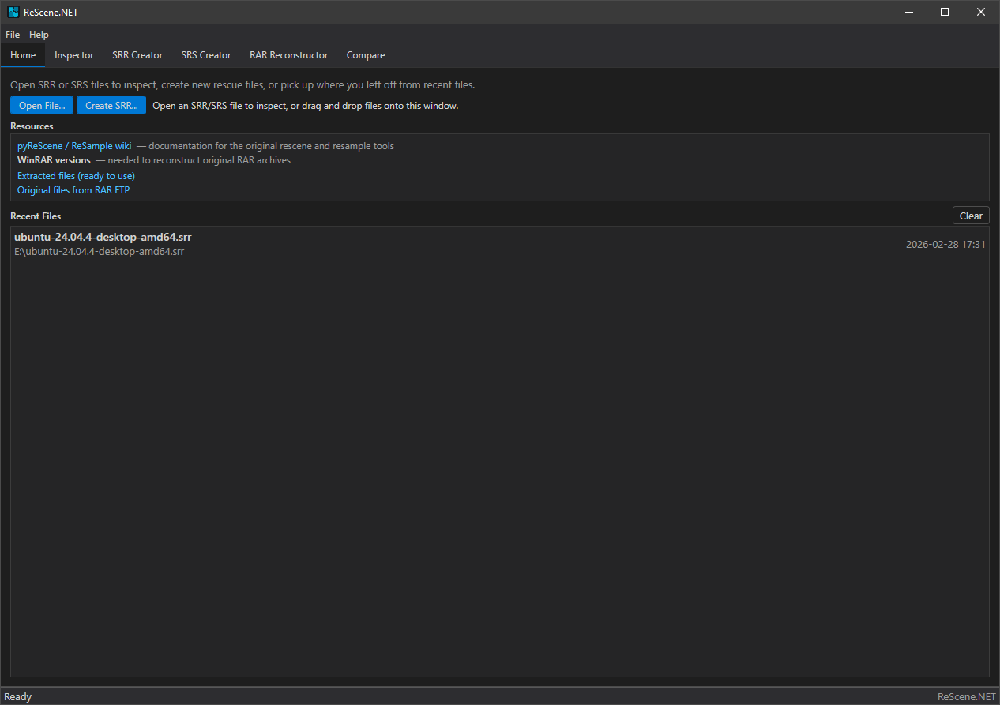
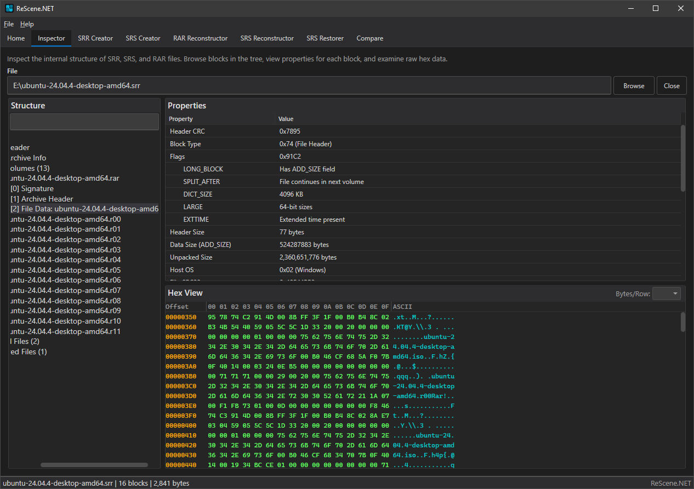
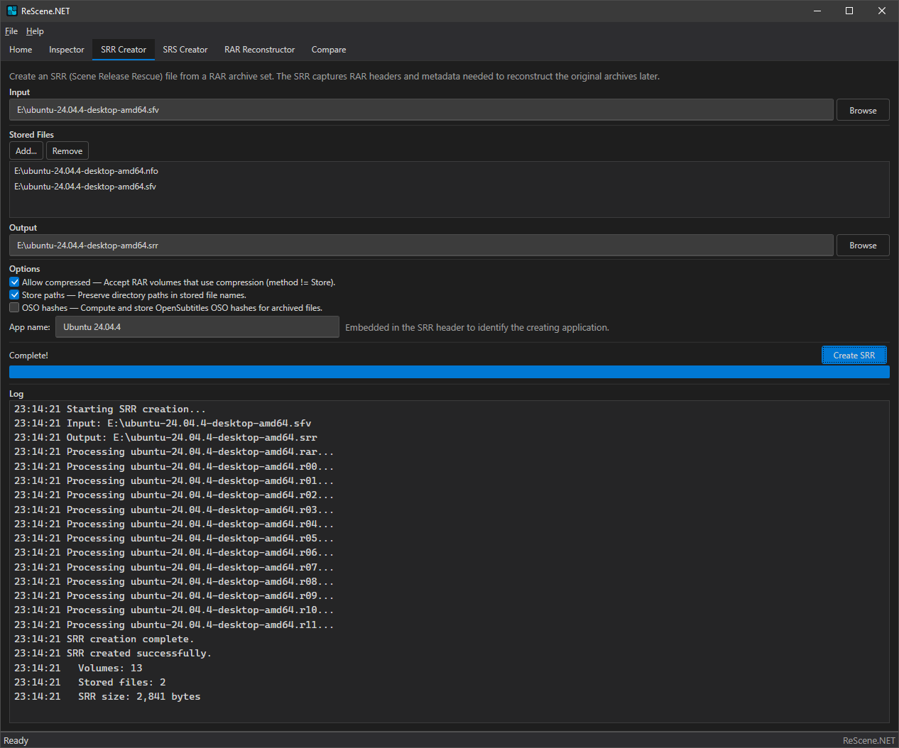
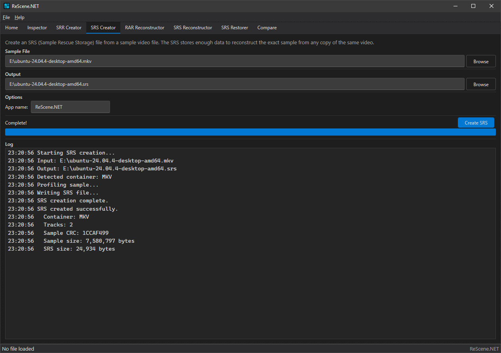
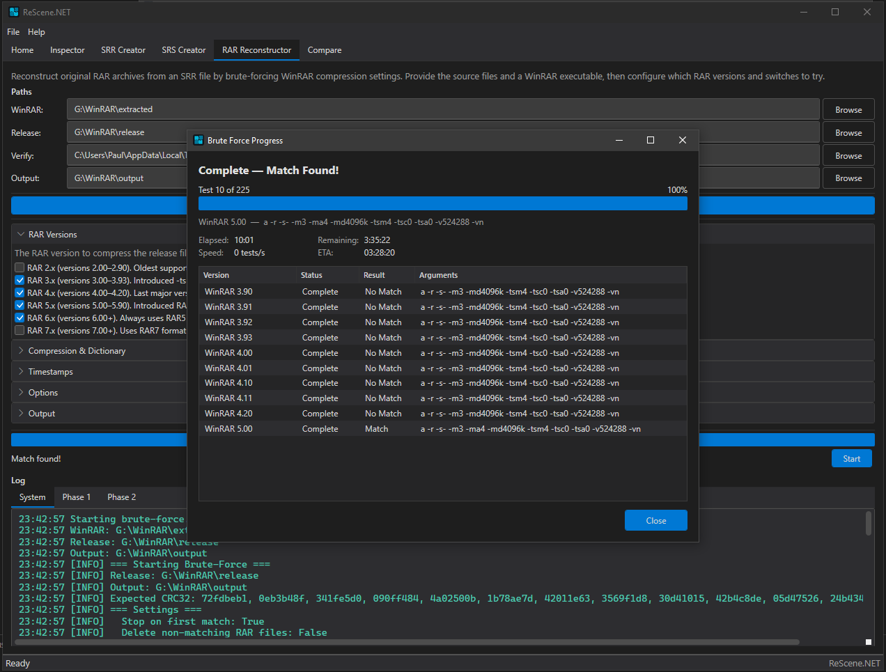
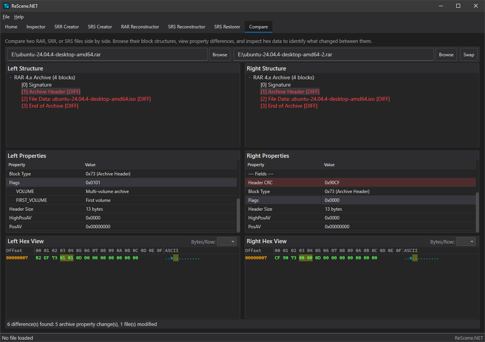

# ReScene.NET

A Windows desktop application for inspecting, creating, and reconstructing [ReScene](https://rescene.wikidot.com/) (SRR/SRS) files, built with WPF and .NET 10.



## Features

### Home

Central hub with quick access to open files, jump to the SRR Creator, and reopen recent files. Includes resource links to pyReScene/ReSample documentation, extracted WinRAR versions, and original WinRAR FTP files. Supports drag & drop of SRR/SRS/RAR files onto the window to open them directly in the Inspector.

### Inspector



Explore the internal block structure of `.srr`, `.srs`, and `.rar` files with a tree view, property grid, and integrated hex viewer. Export individual blocks or stored files directly from the UI. Features include:

- **SRR files**: Header, RAR archive info, OSO hashes, RAR padding, per-volume RAR headers, stored files, and archived file entries with CRCs
- **SRS files**: File data blocks, track data with signatures, and container chunks across all supported formats
- **RAR files**: Block-by-block inspection of RAR 4.x and 5.x archives with detailed flag, CRC, timestamp, and compression metadata
- **Hex viewer**: Configurable bytes-per-line (1–128), offset/hex/ASCII columns, and byte range highlighting linked to the property grid
- **Custom packer detection**: Warning banner for scene group packers (RELOADED, HI2U, QCF)
- **Tree filtering**: Real-time text search across all nodes

### SRR Creator



Create `.srr` files from RAR archives (single or multi-volume) or SFV manifests. Options include:

- Input from RAR files (auto-discovers all volumes) or SFV manifests
- Stored file management — add supplementary NFO, SFV, TXT files
- **Allow Compressed**: Accept volumes using compression methods other than Store
- **Store Paths**: Preserve directory paths in stored file names
- **OSO Hashes**: Compute OpenSubtitles hashes for archived files
- **App Name**: Custom application name embedded in the SRR header
- Real-time progress, timestamped logging, and cancellation support

### SRS Creator



Create `.srs` sample reconstruction files from media files across 7 container formats:

| Container | Extensions |
|-----------|------------|
| RIFF | AVI |
| Matroska | MKV |
| MP4 | MP4, M4V, MOV |
| ASF | WMV |
| FLAC | FLAC |
| MP3 | MP3 |
| Stream | VOB, M2TS, TS, MPG, MPEG, EVO |

Automatic container detection, track parsing, 256-byte signature capture, and CRC32 computation.

### RAR Reconstructor



Reconstruct RAR archives from SRR metadata using brute-force WinRAR version and parameter discovery:

- **SRR Import**: Auto-configures compression method, dictionary size, timestamps, host OS, and file attributes from imported SRR metadata
- **Two-phase matching**: Phase 1 filters by comment block, Phase 2 tests full RAR creation — dramatically reduces search space
- **Version testing**: WinRAR 2.x–7.x with per-version enable/disable
- **Compression**: Methods m0–m5, RAR 4.x/5.x format, dictionary sizes 64K–1GB
- **Timestamps**: Modification, creation, and access time modes (m/c/a 0–4)
- **Volume control**: Multi-volume with configurable size and old/new naming styles
- **Patching**: Host OS, file attributes (Archive/Hidden), and LARGE flag patching
- **Output options**: Delete intermediates, stop on first match, complete all volumes, rename to original names
- **Progress windows**: Dedicated dialogs for brute-force progress, file copy, and CRC validation — each with elapsed time, ETA, and speed metrics
- **Three log streams**: System, Phase 1, and Phase 2 with timestamped entries

### SRS Reconstructor

Rebuild media samples from `.srs` metadata and a source media file. Extracts track signatures, reconstructs the sample byte-for-byte, and verifies the result against the expected CRC32 and file size. Supports the same container formats as the SRS Creator.

### SRS Restorer

Batch-restore media files from an SRR file that contains embedded SRS entries:

1. Import an SRR file — all embedded SRS entries are listed with selection checkboxes
2. Point to a media directory — files are automatically matched by name with status indicators (Found/Not found)
3. Choose an output directory and restore selected samples
4. Per-file CRC32 verification with a summary of succeeded/failed counts

### Compare



Side-by-side comparison of RAR, SRR, and SRS files with dual tree views, property grids, and hex viewers. Differing fields and tree nodes are highlighted in red for quick identification. Supports text filtering across both trees.

## Requirements

- [.NET 10.0](https://dotnet.microsoft.com/download/dotnet/10.0)
- Windows (WPF)

## Getting Started

Clone with submodules:

```bash
git clone --recurse-submodules https://github.com/NeWbY100/ReScene.NET.git
```

If already cloned without submodules:

```bash
git submodule update --init --recursive
```

Build and run:

```bash
dotnet build
dotnet run --project ReScene.NET
```

## Project Structure

```
ReScene.NET/
├── ReScene.NET/            # WPF desktop application (.NET 10)
│   ├── Views/              # XAML views
│   ├── ViewModels/         # MVVM view models (CommunityToolkit.Mvvm)
│   ├── Models/             # Data models
│   ├── Services/           # Business logic (SRR/SRS creation, brute-force, compare)
│   ├── Controls/           # Custom controls (HexViewControl)
│   ├── Helpers/            # Utilities (dark title bar, etc.)
│   └── Resources/          # Themes, design tokens, icons
└── ReScene.Lib/            # Git submodule — shared library
    ├── ReScene/            # Library project (net8.0 + net10.0)
    │   ├── RAR/            # RAR 4.x/5.x header parsing, patching, decompression
    │   ├── SRR/            # SRR/SRS file format reading and writing
    │   └── Core/           # Reconstruction, comparison, brute-force orchestration
    └── ReScene.Tests/      # xUnit tests
```

## Libraries

### ReScene.RAR

Low-level RAR archive header parsing and patching. Supports RAR 4.x and RAR 5.x block structures, file metadata extraction (names, sizes, CRCs, timestamps), comment decompression, in-place header patching with CRC recalculation, and custom scene packer detection.

### ReScene.SRR

SRR and SRS file format support. Reads and writes SRR files (scene release reconstruction metadata) and SRS files (sample reconstruction data) across 7 container formats: RIFF (AVI), MKV, MP4, WMV/ASF, FLAC, MP3, and Stream/M2TS. Includes MP3 tag parsing (ID3v2, ID3v1, Lyrics3, APE), FLAC metadata block parsing, and MKV EBML lacing decompression.

### ReScene.Core

High-level reconstruction and comparison logic. Orchestrates brute-force WinRAR version discovery, RAR archive reconstruction from SRR metadata, host OS / attribute / LARGE flag patching, SRS sample rebuilding, and file-level comparison between SRR/SRS/RAR archives.

## Dependencies

| Package | Version | Project |
|---|---|---|
| [CommunityToolkit.Mvvm](https://www.nuget.org/packages/CommunityToolkit.Mvvm) | 8.4.0 | ReScene.NET |
| [Crc32.NET](https://www.nuget.org/packages/Crc32.NET) | 1.2.0 | ReScene |
| [System.IO.Hashing](https://www.nuget.org/packages/System.IO.Hashing) | 9.0.4 | ReScene |
| [CliWrap](https://www.nuget.org/packages/CliWrap) | 3.10.0 | ReScene |
| [ReScene.Lib](https://github.com/NeWbY100/ReScene.Lib) | submodule | — |

## License

See [LICENSE](LICENSE) for details.
